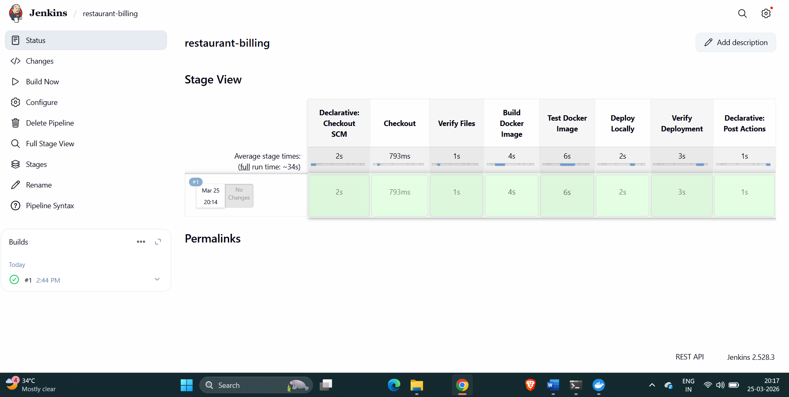

# 🍽️ RestroBilling - Smart Restaurant Billing System

[](https://www.jenkins.io/)
[](https://www.docker.com/)
[](https://developer.mozilla.org/en-US/docs/Web/HTML)
[](https://developer.mozilla.org/en-US/docs/Web/CSS)
[](https://developer.mozilla.org/en-US/docs/Web/JavaScript)

A modern, responsive restaurant billing system with real-time cart management, GST calculation, and bill generation. Complete CI/CD pipeline with Jenkins and Docker.

---

## 📸 Screenshots

### 🖥️ Restaurant Web Application

*The main restaurant billing interface showing menu items, cart system, and bill generation*

### 🔧 Jenkins CI/CD Pipeline

*Automated CI/CD pipeline showing successful build, test, and deployment stages*

---

## 🏗️ System Architecture

```mermaid
graph TB
    subgraph Frontend["Frontend Layer"]
        A[HTML/CSS/JS]
        B[Restaurant UI]
        C[Cart Management]
        D[Bill Generation]
    end
    
    subgraph CICD["CI/CD Pipeline"]
        E[GitHub Repository]
        F[Jenkins Build]
        G[Docker Build]
        H[Test Container]
        I[Deploy Locally]
    end
    
    subgraph Deployment["Deployment Layer"]
        J[Docker Container]
        K[Nginx Server]
        L[Localhost:8081]
    end
    
    A --> B
    B --> C
    C --> D
    
    E --> F
    F --> G
    G --> H
    H --> I
    
    I --> J
    J --> K
    K --> L
