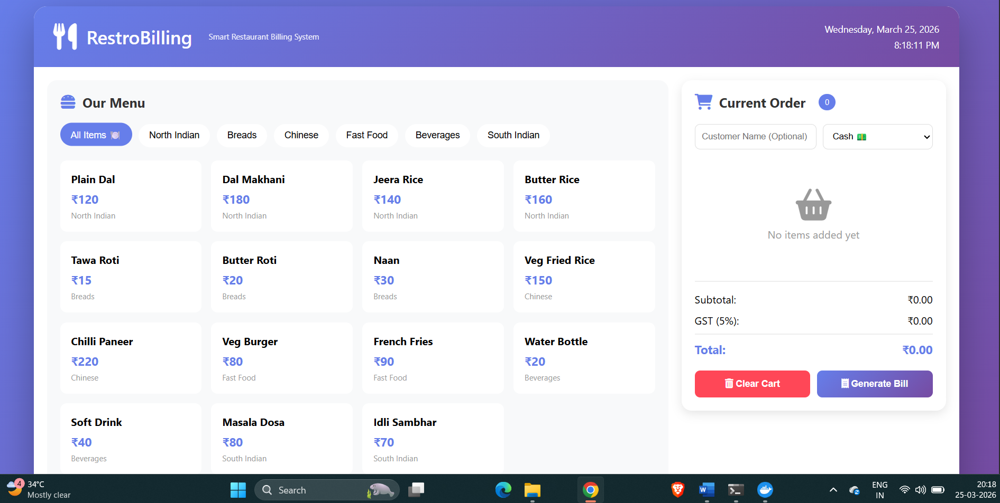
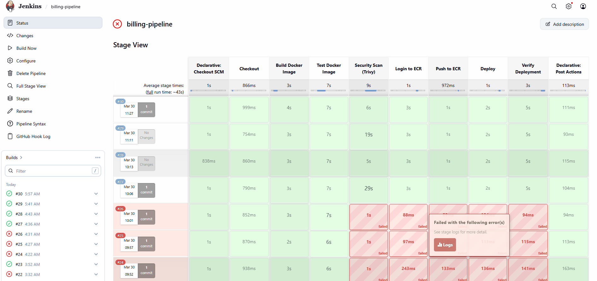

# 🍽️ RestroBilling - Smart Restaurant Billing System

[](https://www.jenkins.io/)
[](https://www.docker.com/)
[](https://aws.amazon.com/)
[](https://trivy.dev/)
[](https://developer.mozilla.org/en-US/docs/Web/HTML)
[](https://developer.mozilla.org/en-US/docs/Web/CSS)
[](https://developer.mozilla.org/en-US/docs/Web/JavaScript)

A modern, responsive restaurant billing system with real-time cart management, GST calculation, and bill generation. Complete CI/CD pipeline with Jenkins, Docker, AWS ECR, and automated deployment to EC2.

---

## 📸 Screenshots

### 🖥️ Restaurant Web Application


### 🔧 Jenkins CI/CD Pipeline - Stage View

*8-stage automated pipeline with successful build, test, security scan, and deployment*

### 📊 Pipeline Execution Details
| Build # | Date | Status | Total Time |
|---------|------|--------|------------|
| #29 | Mar 30 | ✅ Success | ~30s |
| #28 | Mar 30 10:13 | ✅ Success | ~28s |
| #27 | Mar 30 10:06 | ✅ Success | ~35s |

---

## 🏗️ Complete System Architecture

```mermaid
graph TB
    subgraph Developer["👨‍💻 Developer"]
        GIT[Git Push<br/>to GitHub]
    end

    subgraph Jenkins["⚙️ Jenkins CI/CD Pipeline"]
        SCM[1. Checkout SCM]
        BUILD[2. Build Docker Image]
        TEST[3. Test Docker Image]
        SECURITY[4. Security Scan - Trivy]
        ECR_LOGIN[5. Login to ECR]
        PUSH_ECR[6. Push to ECR]
        DEPLOY[7. Deploy to EC2]
        VERIFY[8. Verify Deployment]
    end

    subgraph AWS["☁️ AWS Cloud"]
        ECR_REPO[(Amazon ECR)]
        EC2[🖥️ EC2 Instance<br/>Nginx + Docker]
    end

    GIT --> SCM --> BUILD --> TEST --> SECURITY
    SECURITY --> ECR_LOGIN --> PUSH_ECR --> ECR_REPO
    ECR_REPO --> DEPLOY --> EC2 --> VERIFY
